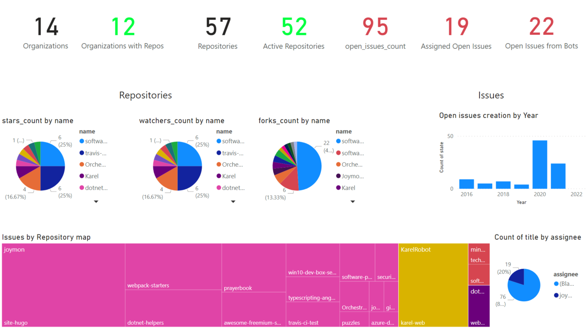
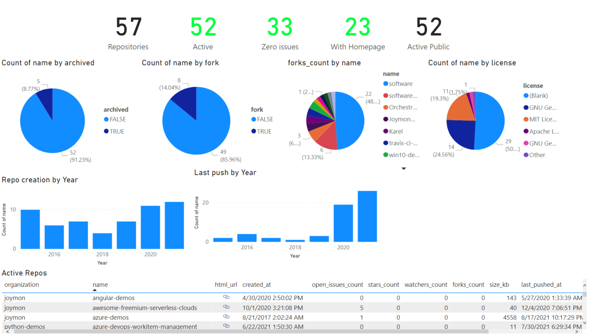
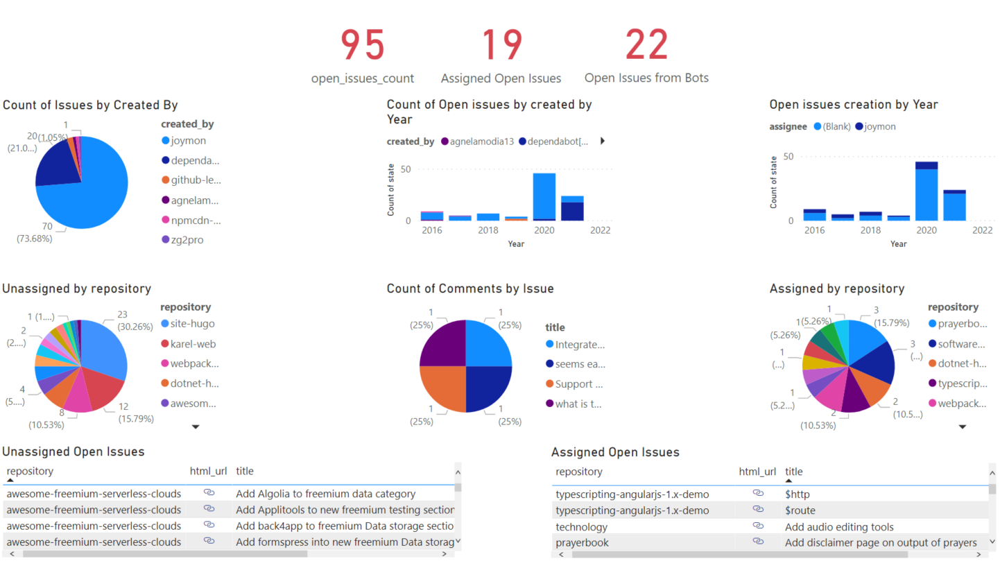

# GitHub Dashboards
Power BI Dashboards for GitHub across all organizations and projects

Unfortunately GitHub [doesn't allow iframe embedding inside markdown.](https://github.github.com/gfm/#disallowed-raw-html-extension-). Hence no PowerBI report embeddeding in readme.md. Please view [live dashboard](https://app.powerbi.com/view?r=eyJrIjoiZjVkNTExMjgtYTYyMS00MWRmLWEwMmItZjBmNjcyYjJiMGIyIiwidCI6IjZiYTQxYTgzLTJmOWYtNGQzMi1iNmU0LTY1YWRlNTBiZDcyMiIsImMiOjN9) or click on the images below

# Images
## Screenshot of organizations dashboard
[][1]

## Screenshot of repositories dashboard

[][2]

## Screenshot of issues dashboard

[][3]

# Built-With

- [GitHub CLI - ETL tool to pull data from GitHub.com](https://cli.github.com)
- [PowerShell - Just to trigger GitHub CLI based ETL (Optional)](https://github.com/features/actions)
- [GitHub - as source control](github.com)
- [GitHub Actions - Run ETL pipeline using GitHub CLI](https://github.com/features/actions)
- [Power BI - Dashboards visualization](https://powerbi.microsoft.com/)   

[1]: https://app.powerbi.com/view?r=eyJrIjoiZjVkNTExMjgtYTYyMS00MWRmLWEwMmItZjBmNjcyYjJiMGIyIiwidCI6IjZiYTQxYTgzLTJmOWYtNGQzMi1iNmU0LTY1YWRlNTBiZDcyMiIsImMiOjN9&pageName=ReportSection "Click to view Power BI Dashboard"
[2]: https://app.powerbi.com/view?r=eyJrIjoiZjVkNTExMjgtYTYyMS00MWRmLWEwMmItZjBmNjcyYjJiMGIyIiwidCI6IjZiYTQxYTgzLTJmOWYtNGQzMi1iNmU0LTY1YWRlNTBiZDcyMiIsImMiOjN9&pageName=ReportSection4d08403eadbb0e10ce84 "Click to view Power BI Dashboard"
[3]: https://app.powerbi.com/view?r=eyJrIjoiZjVkNTExMjgtYTYyMS00MWRmLWEwMmItZjBmNjcyYjJiMGIyIiwidCI6IjZiYTQxYTgzLTJmOWYtNGQzMi1iNmU0LTY1YWRlNTBiZDcyMiIsImMiOjN9&pageName=ReportSection784cb0d10859315038d5 "Click to view Power BI Dashboard"